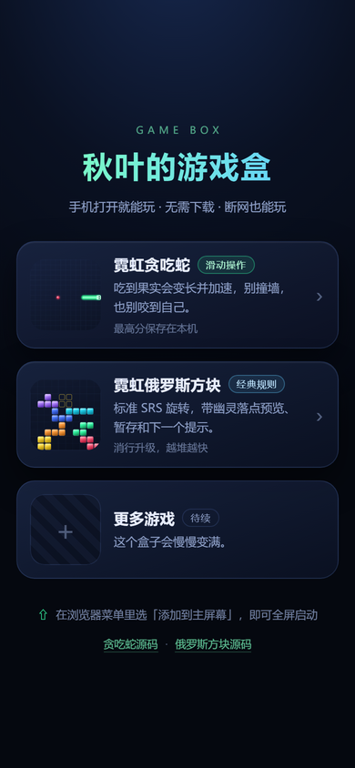

# 🎮 秋叶的游戏盒

手机打开就能玩的小游戏合集导航页，纯静态，挂在 GitHub Pages 上。



**打开游戏盒：<https://qiuye-autumnnight.github.io/>**

> 手机上打开后，在浏览器菜单里选「添加到主屏幕」，就能像小程序一样全屏启动、断网也能用。

## 这个仓库是什么

这是我的 GitHub Pages **用户站点**（仓库名必须是 `<用户名>.github.io`），访问 `https://qiuye-autumnnight.github.io/` 时展示的就是这里的 `index.html`。

它本身不含游戏逻辑，只负责把各个游戏串起来：

| 游戏 | 地址 | 源码 |
| --- | --- | --- |
| 🐍 霓虹贪吃蛇 | <https://qiuye-autumnnight.github.io/snake-game/> | [snake-game](https://github.com/qiuye-AuTumnNight/snake-game) |
| 🧱 霓虹俄罗斯方块 | <https://qiuye-autumnnight.github.io/tetris/> | [tetris](https://github.com/qiuye-AuTumnNight/tetris) |

每个游戏都是独立的仓库、独立的 PWA，可以单独安装到主屏幕；它们的顶部都有一个 🏠 按钮可以回到这里。

## 加一个新游戏

1. 把游戏部署成独立仓库并开启 Pages（例如 `.../my-game/`）
2. 在本仓库 `index.html` 的 `<main class="games">` 里照抄一张卡片，改掉链接与文案
3. 把封面图放进 `covers/`（正方形，建议 300×300），更新卡片里的 ``
4. 把新封面加进 `sw.js` 的 `ASSETS` 白名单
5. 提交推送

## 关于 Service Worker 的一个坑

这是用户站点，Service Worker 的作用域是站点根目录 `/`，也就是 `/snake-game/`、`/tetris/` 这些游戏**也落在它的作用域里**。

如果按常规写法缓存所有同源请求，导航页的缓存就会混进游戏页面，离线时还可能把游戏请求错误地回退成导航页。所以这里的 `sw.js` 只处理白名单里属于自己的文件，其余请求一律不调用 `respondWith`，直接放行给各自的 Service Worker：

```js
const ASSETS = new Set(['/', '/index.html', '/styles.css', /* ... */]);

if (url.origin !== self.location.origin || !ASSETS.has(url.pathname)) return;
```

## 文件结构

```
.
├── index.html              # 导航页
├── styles.css              # 样式
├── sw.js                   # Service Worker（只接管导航页自己的资源）
├── manifest.webmanifest    # PWA 清单
├── icons/                  # 图标
├── covers/                 # 游戏封面
├── screenshot.png          # README 预览图
└── .nojekyll               # 跳过 Jekyll
```

## License

[MIT](./LICENSE)
